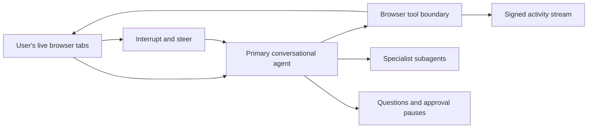

# Pistachio

Pistachio is an open-source, agent-native browser for working with an AI directly inside the tabs and authenticated sessions a person already uses.

The product primitive is a conversation: a person asks for work in plain language, sees browser tool calls and delegated specialists inline, and can interrupt or steer at any time. The primary agent can inspect, navigate, click, type, scroll, capture, and move across the person's tabs without losing their existing sessions. Structured questions, approval pauses, and a signed activity record stay in the same thread. Per-site and per-action guardrails are designed to layer onto this flow from Settings.

The same browser runs in two places. `apps/desktop` is the native client on a Mac. `<PISTACHIO_WEB_URL>/app/browse` is the same chrome in an ordinary browser tab, where the pages are Chromium tabs on the cloud browser fleet, streamed into the page and driven from it; the session there is durable and outlives the tab that opened it. Both mount one shared shell, so a feature exists in both by construction. See [the web browser](docs/web-browser-design.md).

Pistachio is open source, but it is not being designed as a self-hosted product. We operate the control plane, runtime fleet, credential broker, delivery plane, and evidence signing service. The repository includes local fixtures for development and verification; those fixtures are not a supported deployment mode.

## What works now

The first complete native vertical slice lives in `apps/desktop`:

- A guided first run before the chrome appears: a spoken (or typed) introduction that seeds the agent's memory, a one-profile import of sessions and bookmarks from Chrome, Arc, Brave, Edge, Firefox, or Safari, a favorites grid lit in each brand's own colours, and the appearance controls — then the browser is revealed already furnished, with welcome pages (`pistachio://welcome` and three lessons) open. See [onboarding](docs/onboarding.md).
- Electron browser chrome with native `WebContentsView` tabs, spaces, location controls, vertical/horizontal split views, and a Suma-derived side panel.
- Top-tabs or vertical sidebar layout, with pinned and compact (reveal on hover) modes, chosen in Settings. The sidebar keeps a shelf — a favorites grid led by the organization's preset links, pinned pages in collapsible folders, then the day's tabs — all drag-and-drop, persisted per machine, and preserved in the same mounted column through compact reveals. Every chrome feature is declared once with a placement in both layouts; see [chrome layouts](docs/chrome-layouts.md).
- Local appearance customization: system/light/dark schemes, one-to-three-stop gradient themes with linked color harmonies, mesh/linear/radial blending, macOS desktop glass, grain, contrast, translucency, and live corner-radius changes. Browser, window, layout, and delegation shortcuts are editable and remain active when focus is inside a native webpage view.
- Persistent shadcn-based chat with anchored streaming turns, structured clarification prompts, tool activity, subagent status, approvals, and steering.
- Direct control of existing native tabs, preserving the person's cookies, storage, authentication state, and live form state.
- A supermemory-style memory of the person, kept in one local file (`memory.json`): entity-centric facts, static or dynamic, in topical buckets, versioned on update rather than overwritten, soft-forgotten or expired on a date, and reviewed when inferred rather than stated. The profile and the facts that bear on a task are folded into every run's prompt; the agent has `memory_search`/`memory_add`/`memory_update`/`memory_forget` tools; a finished conversation is read for facts worth keeping; and Settings → Memory edits the same file — the quick fields (name, time zone, locations, projects) are keyed memories, not a second store.
- Watchtower: an opt-in desktop archive of readable browsing content, with local full-text search, dated saved versions, shared compressed blocks, comparisons, wiki links, Markdown export, and explicit agent retrieval. Optional Jev decisions improve search ranking without model calls during capture. Open Menu → Watchtower; see [implementation and limits](docs/watchtower-implementation.md).
- Reminders the agent schedules from conversation — "remind me in 20 minutes", "every Sunday at 8am send me a summary of my week" — kept in one local file (`reminders.json`): one-off, interval, daily, weekly, or monthly schedules in the person's time zone, firing either a fixed message or an agent task that runs as a visible console run with every tool the agent has. Fired reminders appear as cards in the chat and as desktop notifications; `pistachio://reminders` (⌘⇧R) is a calendar of what fired, what is coming, and each run's output. See [reminders](docs/reminders.md).
- Artifacts the desktop or cloud agent builds when the deliverable is a document at heart — "make me a site", "a custom news feed every morning at 6" — complete HTML pages written by a dedicated coding model from material the agent gathered. They live at stable web-app URLs, stay end-to-end encrypted and account-private by default, and can be deliberately published to revocable HTTPS share links. A recurring deliverable keeps the design and URL while refreshing the content. See [artifacts](docs/artifacts.md).
- A browser-agent tool surface for listing, opening, and focusing tabs; navigation; semantic page inspection; clicking; typing; scrolling; and screenshots.
- A versioned semantic adapter maps the demo network action to `invoice.submit_reconciliation`.
- Deterministic policy derives classifications from intercepted requests and returns `allow`, `deny`, or `require_approval`; approval becomes an exact origin/method/adapter/action/path-pattern, expiring, one-use capability consumed on the wire.
- Structured approval evidence, reject, instant takeover, return of control, completion summary, and before/after state.
- Immediate interruption and takeover without moving the work into a second tab.
- Ed25519-signed, SHA-256 hash-chained evidence with actor → sponsor → task attribution, verifier invariants, and external-root checking.
- Idempotent notification adapters plus leased, bounded-retry scheduled occurrences whose capability ceilings are re-intersected at delivery time.
- A hosted run coordinator contract with worker fencing, durable pause semantics, pause-expiry sweeping, cross-device reattachment, approval-time policy checks, and authority-before-completion ordering.
- End-to-end-encrypted cross-device sync of sessions (cookies), Spaces, and per-device tab restore points through a control plane with email + password accounts, device enrollment, signed device tokens, and wrapped-key storage; the server stores only sealed records and pseudonymous ids. See [cloud sync design](docs/cloud-sync-design.md).
- A cloud browser that runs the agent when no desktop is online: an enrolled sync device with its own keys, exclusive origin leases while it drives, a live view with takeover streamed to the desktop, and an authenticated webhook channel for starting runs.
- A per-user static-IP egress gateway so the desktop and the cloud browser present the same IP to every site, with expiring device-bound credentials and fail-closed proxying.

The same shell also runs in a browser tab, at its own site, over the cloud browser instead of local Electron views. All six stages of [the web browser design](docs/web-browser-design.md) are on the branch — S6, the completeness pass, is what §11's capability table records:

- There are two web apps (`apps/www`, the site and account dashboard; `apps/web`, the browser), and one account layer under both — `@pistachio/web-account`.
- The desktop renderer and its contracts are workspace packages — `@pistachio/shell-ui` and `@pistachio/shell-contracts` — consumed by desktop main, the desktop renderer, the worker, and the browser app. The tree reaches its host through two seams: an API seam (`setShellApi`) and a surface seam, which is either native holes the desktop places `WebContentsView`s over or DOM panes the web app paints a screencast into.
- A `ShellHost` in `services/cloud-browser/src/sessions/` plays the part Electron main plays: the source of truth for the shell snapshot and the executor of every call. It answers tabs, spaces, splits, the shelf, settings (a sealed synced document, so theme, layout and shortcuts cross between a Mac and a browser tab), find in page, the whole console, and everything S6 added — downloads and uploads, the clipboard, print, the right-click menu, reader view, site permissions, browsing data, media, zoom and the personal records. What is left over is declared rather than approximated: one `UNSUPPORTED` list in the host, each entry carrying a reason a person reads in place of the affordance (W12), covering what a browser tab cannot be and the settings the dashboard's own pages own — where the shell offers a link across to it.
- A browser session is durable and per user and Space. Control records it and its lease; whichever worker the socket lands on claims it on demand or relays to the holder; its tabs, splits, shelf, per-origin zoom and the answers given to each site's permission prompts persist as a sealed workspace record, so a session suspended overnight comes back on another machine. With no viewer and no run it suspends after `CLOUD_BROWSER_SESSION_IDLE_MS`.
- One WebSocket (`/v1/shell/:sessionId`) carries an RPC envelope over the shell API, both snapshot channels, per-pane JPEG screencast frames, and input. Its authentication is the live view's, unchanged: the browser app's origin pinned on upgrade, a one-minute one-redemption ticket, and proof of the Space key before the host sends a byte of state.
- An agent run attaches to the session's tabs and holds authority only while it runs. Control keeps a generation with each handover, and every forwarded input and tool call carries the generation it was issued under, so a takeover is immediate and a stale actor is dropped rather than raced.

The demo is intentionally narrow: Northstar Finance invoice reconciliation. It exists to verify the security and interaction contracts through one real flow, not to stand in for the hosted runtime.

## Run it

Requirements: Node 22+, pnpm 9+, and a complete Electron runtime.

```bash
pnpm install
pnpm --filter @pistachio/desktop dev
```

Validation:

```bash
pnpm check-types
pnpm test
pnpm test:e2e
```

Memory search is lexical on its own and adds vector similarity when an embedding model is reachable through the same provider as the agent (`PISTACHIO_MEMORY_EMBEDDING_MODEL`, default `openai/text-embedding-3-small`; `off` disables it). Vectors live beside the facts in `memory.json` and are rebuilt when the model changes.

### The web browser

```bash
pnpm dev:cloud
```

That runs control, the egress gateway, the cloud browser worker, and both web apps: the site and dashboard (`www`) at `http://localhost:3000`, and the browser (`web`) at `http://localhost:3001`. The browser opens once an account exists, a Space has the cloud enabled, and the tab is unlocked; the dashboard's rail links to it.

Nothing loads `.env` on its own — turbo hashes it for caching but does not export it — so export it in the shell first (`set -a; . ./.env; set +a`), or run `pnpm dev:ready`, which loads the root `.env`, waits for control's health check, and starts the desktop as well. `.env.example` documents every variable; four decide whether the browse route works:

- `CLOUD_BROWSER_PUBLIC_URL` — the fleet's single public address, which control advertises and points session tickets at. Unset, creating a session answers `no_cloud_browser`.
- `CONTROL_ALLOWED_ORIGINS` — the exact browser origins control answers cross-origin. Unset, control emits no CORS headers at all and the page cannot reach the API.
- `PISTACHIO_BROWSER_URL` — the browser app's origin, and the only one a shell socket upgrade may carry. The worker refuses any other, so a page elsewhere cannot drive someone's browser. (`PISTACHIO_WEB_URL` stays the dashboard's: capture and iMessage links, artifact views, and a run page's live view.)
- `NEXT_PUBLIC_PISTACHIO_BROWSER_URL` and `NEXT_PUBLIC_PISTACHIO_WWW_URL` — what each site tells the browser about the other: the dashboard's "Open the browser", and the browser's links back to the pages the dashboard owns.
- `CLOUD_BROWSER_SESSION_IDLE_MS` — how long a session stays claimed with no viewer and no run before it publishes its record and suspends (default 30 minutes; lower it to exercise the suspend and rebuild path).

The web end-to-end test drives the real thing — control on PGlite, a cloud browser worker with real Chromium, a fixture site, and `next dev --webpack`:

```bash
cd apps/desktop && npx playwright test -c e2e/playwright.config.ts e2e/tests/web-browse.spec.ts
```

It signs up in the browser app, enables the cloud for the Space, lands on the shell at `/`, creates a tab through the shell's own chrome, types into the page, then reloads the outer page and finds the same tab live. `web-two-apps.spec.ts` walks the seam between the two sites: sign up on the dashboard, follow "Open the browser", sign in there as a second device, and find the same Space. It skips when no Chromium build is available; `PLAYWRIGHT_CHROMIUM_EXECUTABLE_PATH` points it at one.

`desktop-web-sync.spec.ts` covers desktop-first signup, native page execution,
cloud session restoration, portable draft and scroll state, and returning to
an existing web session. Run it after building desktop:

```bash
pnpm --filter @pistachio/desktop build
pnpm --filter @pistachio/desktop exec playwright test -c e2e/playwright.config.ts e2e/tests/desktop-web-sync.spec.ts
```

Desktop pages always run locally in native Electron views. Signed-in desktop
sync publishes session checkpoints for the web app to resume, while Fly can
continue proxying desktop network traffic. The web app renders its own cloud
pages and supports linking web viewers. See [session continuity](docs/shared-browser.md)
for supported page state and persistence boundaries.

The Electron test captures six reviewed frames under `apps/desktop/e2e/screenshots/delegation`: browser ready, human split, approval pause, takeover, completed/revoked, and evidence replay. On a constrained development machine, `PISTACHIO_ELECTRON_PATH` can point the test runner at an existing Electron executable.

## Architecture



Packages are split on trust boundaries:

- `@pistachio/protocol`: public task, capsule, approval, and run contracts.
- `@pistachio/policy`: deterministic grants and one-time approval enforcement.
- `@pistachio/adapters`: versioned app-specific network-to-business-action mappings.
- `@pistachio/evidence`: canonical hashing, Ed25519 signatures, verification, and replay records.
- `@pistachio/notifications`: channel adapters, delivery idempotency, occurrence leases, and fire-time capability intersection.
- `@pistachio/runtime`: hosted run records, worker leases, durable pauses, reattachment, and authority revocation ordering.
- `@pistachio/shell-contracts`: the shell's IPC surface, snapshot shapes, and the shell socket protocol, shared by desktop main, the shell UI, the cloud browser's host, and the web app.
- `@pistachio/shell-ui`: the browser chrome itself — one React tree behind an API seam and a surface seam, mounted by the desktop renderer and by the browser app's one route.
- `@pistachio/web-account`: the account layer both web apps sign in with — the device and its keys, the control client, the sealed workspace records, and the gate with its own stylesheet.

Applications:

- `apps/desktop`: the Mac app (Electron main, preload, and the renderer entry that mounts the shell).
- `apps/www` (package `www`, port 3000): the landing pages, download, docs, early access, privacy, artifact shares, credential capture, iMessage onboarding, and the account dashboard under `/app`.
- `apps/web` (package `web`, port 3001): the browser — the shell on a stream surface, at `/`, and nothing else.

The browser session, its host, the shell socket and the session claimer live in `services/cloud-browser/src/sessions/`; the page that mounts the shell in a tab is `apps/web/app/page.tsx`.

See [architecture](docs/architecture.md), [the web browser](docs/web-browser-design.md), [security model](docs/security.md), and [shipping a release](docs/releasing.md).

## Project boundaries

Pistachio does not aim to reproduce Island’s endpoint-management matrix. V1 centers the handoff: native capture, hosted continuation, deterministic authority, evidence-rich pauses, instant human control, explicit return of work, and automatic revocation.

We are deliberately not building local-control-plane installation, endpoint DLP, universal business-action inference, IAM, Windows endpoint management, files/IDE/media features, or endpoint management beyond the browser. Managed hosting is part of the trust design, not merely a packaging choice.

## License

GPL-3.0. Suma is AGPL-3.0; GPL-3.0 §13 permits combining the two, but extracted Suma code stays under AGPL-3.0 unless its copyright holder relicenses it. Suma’s repository history currently shows a single author identity; confirming that identity controls all relevant copyrights remains a release gate before any verbatim Suma extraction is published under GPL-3.0.
