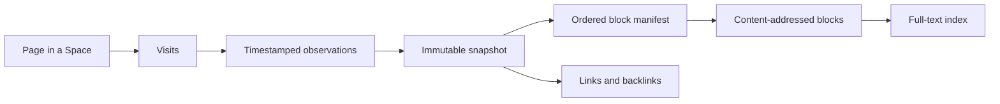

# Watchtower: implementation design

Status: design dated 2026-09-18; desktop implementation added 2026-09-19. See [implementation notes](watchtower-implementation.md) for the shipped scope, limits, and validation.

This is a review and refinement of the existing, untracked
[Watchtower draft](watchtower.md), which was left unchanged. Scope assumptions:
design for review first; desktop capture first, with shared contracts and an
explicit path to the web browser. These are proposed defaults, not confirmed
product decisions.

## 1. The product contract

Watchtower is a searchable Markdown library of the substantive content available
in pages the person visited, organized by page and visit. A search result opens
the saved content from that visit, even if the live site has changed or vanished.

The crucial distinction is **a visit is an event; a snapshot is immutable content**.
Many visits can refer to the same snapshot. Different snapshots can share most of
their blocks. Search and provenance must preserve both relationships.

It is a text memory, not a pixel recording. Preserve headings, prose, lists,
tables, quotations, code, useful links, captions, and a small source metadata card.
Do not preserve page HTML, executable scripts, CSS, class names, or media files.
Images contribute available alt text/captions. Videos contribute title, creator,
description, playback context and available transcript text. Something shown only
inside an image, canvas, inaccessible frame or untranscribed video is not fully
searchable in this version.

“Captured from this page” does not mean “you read every word.” The model records
foreground attention and capture coverage separately from content. It must expose
partial, metadata-only, unsupported and expired captures honestly.

First-release user flows:

1. Search “that article about pistachio blight,” optionally narrowing by site,
   date, Space or content type; get dated excerpts and open the saved page.
2. Search for a half-remembered video using its subject, creator or transcript;
   see when it was visited and what evidence matched.
3. Browse a page's visits, select a historical observation, and compare versions.
4. Follow archived links and backlinks, or export a navigable Markdown wiki.
5. Pause capture, exclude a site or Space, delete a time range, and inspect usage.

## 2. What exists in the repository

| Existing code                                                                      | What to reuse, and what needs to change                                                                                                                                          |
| ---------------------------------------------------------------------------------- | -------------------------------------------------------------------------------------------------------------------------------------------------------------------------------- |
| `apps/desktop/src/main/browser-controller.ts`, `#wireManagedTab`, `#visibleTabIds` | Navigation, SPA, lifecycle and split-pane signals. Add a narrow event sink; avoid embedding archive logic in this large controller.                                              |
| `packages/shell-contracts/src/reader-extract.ts`                                   | Article scoring and structured extraction as a starting point. Its whole-document scoring and recursive synchronous walk need a bounded, yielding variant for automatic capture. |
| `packages/shell-contracts/src/reader.ts`                                           | Validated block types and Markdown conventions. Add Watchtower-specific aggregate limits, faithful tables and deterministic serialization.                                       |
| `apps/desktop/src/main/reader-store.ts`                                            | Snapshot presentation patterns; this store is transient and limited to 12 articles, so it cannot be the archive.                                                                 |
| `packages/agent-runtime/src/views/bookmarks.ts`                                    | Typed metadata extraction ideas. Do not reuse `bookmarkUrlKey`: it deliberately conflates schemes, `www` and trailing slashes.                                                   |
| `packages/shell-ui/src/lib/recents.ts`                                             | Currently just 24 recent hosts in renderer storage. It is neither complete visit history nor a source of past page content.                                                      |
| `apps/desktop/src/main/memory-engine.ts`                                           | Agent retrieval patterns, but its embedder uses the configured remote provider. Do not automatically send browsing content through it.                                           |
| `packages/shell-contracts/src/ipc.ts`, desktop preload/main, cloud `ShellHost`     | Shared API, validation and capability boundary. All surfaces must agree whether capture/search are available.                                                                    |
| Desktop protocol handlers in `main/index.ts` and `BrowserController`               | Both must serve archive documents; Space authorization must apply to snapshot reads as well as search.                                                                           |
| `apps/desktop/electron.vite.config.ts`                                             | Add the shared package to bundled workspace dependencies and a separate archive-process entry.                                                                                   |

The browser already has distinct desktop and cloud hosts. Cloud shell settings
have a synced `shellSettings` record; do not assume a new field stays local just
because it was added to a shared settings type. Explicitly classify capture consent,
pause state, exclusions, retention and archive content by host/sync policy.

## 3. Storage: complete manifests over shared blocks



Use one local SQLite database owned by an Electron utility process. Body storage,
hashing, compression, indexing, search, export and maintenance run there. SQLite's
`DatabaseSync` is synchronous, so it belongs outside the browser main process.
[Node SQLite documentation](https://nodejs.org/api/sqlite.html#class-databasesync).
Electron provides a child-process mechanism with message ports suitable for this
boundary. [Electron utilityProcess](https://www.electronjs.org/docs/latest/api/utility-process).

Proposed logical model (the migration will add concrete types and constraints):

```text
page(id, space_id, identity_url, first_seen_at, last_seen_at)
visit(id, page_id, navigation_id, visited_url, title_at_visit,
      started_at, ended_at, foreground_ms, device_id, actor, capture_status)
observation(id, visit_id, snapshot_id?, captured_at, coverage, reason,
            media_position?, extractor_version)
snapshot(id, page_id, digest, format_version, metadata, created_at)
snapshot_block(snapshot_id, ordinal, block_id)
block(id, hash, codec, byte_length, compressed_markdown)
block_fts(rowid = block.id, searchable_text)
snapshot_link(snapshot_id, ordinal, target_url, anchor_text)
archive_meta(schema_version, policy_epoch, index_version, ...)
```

Required indexes include `(space_id, identity_url)`, visits by `(page_id,
started_at, id)`, observations by visit/time and snapshot, reverse block references
by `(block_id, snapshot_id)`, and a unique `(page_id, digest)` for snapshots.
Manifest rows use `(snapshot_id, ordinal)` as the primary key. Foreign keys are
enabled. Ingestion is transactional; page/snapshot/manifest/FTS updates must not
leave a half-readable snapshot. Navigation and observation IDs make retries
idempotent after uncertain acknowledgments.

### Block identity and reconstruction

Start with independently addressed semantic blocks: paragraph, heading, list
item, table row, code segment, metadata card. Avoid packing adjacent paragraphs
greedily: an insertion would otherwise shift later chunk boundaries. Oversized
blocks use deterministic, bounded content-defined splitting; preserve separators
in the representation so reconstruction is exact. Compare this strategy against
packing in the storage benchmark before choosing thresholds.

Use full SHA-256 of versioned, deterministic UTF-8 Markdown bytes. On an existing
hash, verify length/content before reuse; a detected collision fails the capture
instead of substituting content. Normalize ordinary whitespace but preserve code,
list order, table cells and meaningful punctuation. Never use fuzzy similarity to
discard source text. Repeat occurrences of a block stay in the manifest.

The snapshot digest covers the ordered block identities **and** meaningful
metadata, coverage and format version. Title-only or description-only changes
therefore remain historically searchable. Visit timestamps and dwell time do not
participate in content identity. New observations with identical content reuse an
existing snapshot, including the sequence A → B → A, not just adjacent revisits.

Example:

```text
September 1 visit  -> snapshot A: [heading, paragraph 1, paragraph 2, paragraph 3]
September 15 visit -> snapshot B: [heading, paragraph 1, changed paragraph 2, paragraph 3]
September 18 visit -> snapshot B again
```

The second visit adds the changed block and a manifest; the third adds only visit
and observation metadata. Both snapshots still reconstruct as whole documents.
There is no chain of patches to replay. “What changed” computes a diff on demand
over manifests, with a finer word diff for changed blocks.

Compress each block only when compression saves space, recording its codec.
Use a codec supported by every archive reader; deflate is the initial baseline,
and zstd is a measured option after checking the packaged runtimes. Physical
deduplication may span Spaces within the same local profile, but every lookup is
authorized through a Space-scoped snapshot. No cross-account/global content store.

Markdown is the durable content representation. SQLite supplies efficient storage
and lookup; it does not require a redundant `.md` file on disk for every revisit.
Export materializes ordinary Markdown files, a page index, version links and a
visit manifest. Personal notes, if added later, live separately from immutable
source snapshots.

### URL identity

Keep the visited URL separately from a conservative identity URL. Preserve scheme,
host, path, trailing slash, meaningful query parameters and hash-based app routes.
Strip only explicitly recognized tracking parameters under versioned rules; do not
sort arbitrary query parameters or erase all fragments. A normal heading fragment
can map to the same page, while its original anchor remains on the visit.

Treat `rel=canonical` as an alias hint, not authority to merge records: even a
same-host canonical may collapse pagination, searches or personalized content.
Identical text already deduplicates without merging page identities. Preserve useful
source links, while omitting URL credentials and known secret-bearing URL fields.
Record any such sanitization; do not claim a redacted URL is byte-identical.

## 4. Capture without slowing the browser

Separate cheap history recording from expensive content extraction. Record eligible
human navigations as lightweight visit events, including short visits; prioritize
content when a page becomes visible. Background-only loads and redirects are marked
as such and do not count as something the user saw. Excluded/private/disabled
contexts create no Watchtower record. Agent activity in an existing human tab needs
an actor signal; tab kind alone is insufficient.

Initial scheduling values, subject to measurement:

| Work                  | Initial budget or trigger                                                                       |
| --------------------- | ----------------------------------------------------------------------------------------------- |
| Navigation metadata   | Asynchronous event enqueue; no DOM scan                                                         |
| First content capture | About 1 second foreground dwell, after a 500 ms quiet period                                    |
| Busy/streaming page   | Attempt a bounded partial capture after 5 seconds; never wait indefinitely for network idle     |
| DOM traversal         | Cooperative slices targeting 4 ms, with a node/work limit per slice                             |
| Capture limits        | 200 ms cumulative traversal budget, 20,000 nodes, 1,500 blocks, 256 KiB UTF-8 payload           |
| Concurrency           | One capture per tab and initially one per browser host                                          |
| Dynamic recapture     | Debounced meaningful main-content changes; at most once per 30 seconds unless the route changes |
| Pending content       | At most 16 items and 4 MiB; coalesce repeated jobs for the same visit                           |

These are starting constraints, not latency guarantees. Measure layout/style reads,
IPC serialization and validation too. `requestIdleCallback` only schedules a
callback: it does not split a long function, and its timeout can force work during
a busy period. The traversal must explicitly yield and cancel.
[MDN requestIdleCallback](https://developer.mozilla.org/en-US/docs/Web/API/Window/requestIdleCallback).

Use a browser-controlled isolated world, but treat all DOM content as untrusted.
Isolation avoids page-patched JavaScript globals; it does not make the shared DOM
truthful or frozen. Prefer an incremental TreeWalker with a traversal stack;
avoid whole-page `innerText`, deep clones, repeated subtree scans and unbounded
selector results. Bound metadata/JSON-LD input before parsing, as well as its depth
and field count. Check hidden/editable descendants in every extraction branch,
including inline links, lists, tables and fallback text.

Extraction order:

1. Article/main-content structure, with a bounded scoring pass.
2. Generic substantive blocks for forums, documentation, product pages and feeds.
3. Metadata-only card when there is too little readable content; short pages and
   video pages should not disappear just because they fail an article word floor.

Revision note (2026-09-19, product decision): which layout regions are
furniture is decided per site layout, not per page — remembered rules, then
decisive local evidence, then the Jev decision model for what is left, shown
only a short excerpt and the region's place and link share, once per layout.
It is a setting, disclosed on the enable screen, and off means capture makes
no network request. See "What is saved" in the implementation record.

Drop navigation menus, cookie dialogs and promotion furniture. Keep substantive
discussion when it is the page's subject; do not globally discard all “comments.”
Never read input values, textareas or editable drafts. Hidden content, cross-origin
frames and inaccessible surfaces are omitted, with coverage explaining limitations.

Each job carries a tab/document/navigation generation and policy epoch. Recheck
them before accepting and before committing. A navigation, pause, exclusion or
forget operation invalidates in-flight jobs. URL equality alone cannot detect a
reload race. SPAs need a new route identity plus a generation check; same-URL
content changes create new observations, not fabricated navigations.

Retain multiple timestamped observations within a visit. Do not replace the first
snapshot with a final accumulated feed and call it what the person saw throughout.
For virtualized feeds, previously removed items remain available through earlier
observations; an optional “collected during this visit” view must be labeled as an
aggregate. A bounded dirty signal can prompt recapture without watching every DOM
mutation forever. Do not rely on asynchronous extraction during unload or delay
navigation/close to finish it.

Foreground time uses window visibility, focus and actual pane visibility. Background
media listening can carry a separate attention type using existing media reports.
Capture adapters can preserve already-available transcript/caption text and video
timestamps. No background video downloading, audio recording or automatic remote
transcription. Without transcript text, a remembered spoken detail may not be found.

When overloaded, prioritize current visible pages, drop stale pending extraction,
and retain the visit with an explicit missing-content reason. If even metadata
cannot be written, report a capture gap. Record aggregate counters, not page bodies
or sensitive URLs in logs. Worker failure, disk-full and archive corruption must
leave ordinary browsing operational.

## 5. Search that respects history

Start with SQLite FTS5 over unique blocks, including versioned metadata blocks.
Use a contentless-delete index to avoid duplicating stored body text. Snippets come
from decompressing a small number of matching blocks; index and body mutations
share a transaction. FTS5 documents this index mode and its delete support.
[SQLite FTS5](https://www.sqlite.org/fts5.html#contentless_delete_tables).

Never use only a mutable page-title index to answer historical content queries.
The required relationship is:

```text
matching blocks -> snapshots containing those blocks
                -> observations of those snapshots
                -> visits satisfying time and Space filters
```

If a new phrase appeared yesterday, it must not match a visit from two weeks ago.
If terms appear in different blocks of one snapshot, that snapshot must still match.
Intersect term hits at the snapshot level, never across different versions of a
page. For quoted phrases, verify adjacency against reconstructed text where a
phrase crosses storage boundaries. Prefix/diacritic/token rules must agree between
candidate generation, verification and highlighting.

Query design:

- Plain text, quoted phrases and `site:`, `kind:`, `space:`, `after:`, `before:`.
  Start with explicit ISO dates; resolve natural-language dates through the agent
  or visible date controls, displaying the resolved interval and timezone.
- Bind SQL parameters and compile a small supported query grammar; never pass raw
  user text straight into FTS syntax. Cap query length, terms and candidate work.
- Apply authorization and date filters before result limits. Adapt the query plan
  for selective dates versus selective terms. Global top-K chunks followed by
  date filtering can silently miss the only relevant historical result.
- Rank title/creator/headings, term coverage and proximity first. Recency and visit
  count are weak tie-breakers, so an old exact match can beat a recent vague one.
- Group ordinary results by page with the actual matching visit/observation exposed;
  allow “all visits.” The snippet and opened document must use that same snapshot.
- Use cancellable requests, stable pagination and bounded decompression caches.

Use Unicode tokenization as the baseline; English Porter stemming is not a general
language solution. Evaluate CJK substring/token search, spelling variation and
multilingual fixtures before advertising equivalent recall in those languages.

### Fuzzy recall is part of the intended feature

Keyword search is the first milestone, not proof that “I vaguely remember that
video” works. After the archive is reliable, add an asynchronous local semantic
index over unique substantive blocks. Embed once per block/model version, pause
work on battery or while the browser is busy, and combine lexical/vector candidate
rankings. Use neighboring blocks from the matched snapshot for context.

Choose the embedding model/runtime only after measuring retrieval quality, download
size, resident memory, battery use and language coverage on the target Mac. A
1-million-vector index at 384 dimensions consumes about 384 MB for int8 vectors
alone, before graph/index overhead; this is a distinct storage budget. Bound the
semantic backlog and permit lexical-only operation while it catches up.

Agent-assisted query expansion can help in the meantime, but it cannot recover
uncaptured content or guarantee synonym recall. The existing remote memory embedder
is not an automatic fallback. If the person asks the hosted agent to search their
archive, disclose that returned excerpts become model input and honor the existing
agent data policy. Never put the full archive into a system prompt. Archived page
text remains untrusted source material, not instructions to the agent.

## 6. The wiki and browser surfaces

Build the archive UI once in `packages/shell-ui`:

- `pistachio://watchtower`: search plus a day/site timeline, explicit capture state,
  filters, and a page view with its visit history.
- A saved observation opens a reader-style document with source URL, visit time,
  capture time, coverage, “Open live,” version selector and “What changed.”
- Source links keep their original destinations. “Open archived” resolves to an
  appropriate saved observation and displays its date; backlinks are derived from
  versioned link records and obey Space scope.
- The address palette retrieves a few content matches after a short debounce;
  stale responses never replace results for newer text.
- `watchtower_search` returns bounded excerpts plus visit/observation/snapshot IDs;
  `watchtower_read` accepts an observation ID and supports bounded pagination.
  Tools enforce authorized Spaces and the archive access setting in the host.
- Chrome actions appear in both supported layouts through the existing manifest.

Render saved content as escaped, inert output with a strict content policy. Opening
an archived page must not fetch live images, remote favicons or tracking resources;
otherwise the snapshot both changes and contacts sites behind the person's back.
User-initiated “Open live” is explicit. The existing reader renderer requires an
audit before reuse because Watchtower has stronger offline requirements.

Export uses collision-safe filenames containing stable IDs, escaped front matter,
relative wiki links and separate visit provenance. The same snapshot may be visited
many times; export it once and list those visits rather than duplicate files.
Exported source documents remain immutable records; a notes layer is a later feature.

## 7. Retention, deletion and reliability

Proposed activation: an explicit first-use choice, then automatic capture on eligible
pages. Provide pause, excluded domains/Spaces, storage usage and a clearly visible
capture state. Sensitive-site presets are editable conveniences, not reliable
classification. A password-field heuristic is only a fallback; it does not identify
every sensitive authenticated page.

Provisional default: no age expiration and a configurable 2 GiB archive budget.
Warn before capacity and stop new body capture at the limit unless the person has
chosen automatic pruning. This preserves the promise that existing memories do not
silently disappear. Metadata also counts toward the cap: when no safe headroom
remains, pause archive writes entirely and report the gap. With pruning enabled,
expired content becomes an explicit metadata-only history item; never substitute
today's snapshot for missing historical text.

Account for database, FTS, manifests, WAL, caches and optional embeddings separately.
Keep free-space headroom for transactions and maintenance. Prune visits/observations
under the chosen policy, then delete snapshots with no retained references, then
unreferenced blocks. An old snapshot visited again yesterday is still recent evidence.
Reclaiming a shared block is allowed only when its last reference is gone.

“Forget this time range” removes those visits and observations; identical content
visited outside the range can remain. “Forget this page/site” removes all matching
provenance. Explain this distinction in the action. Pause/cancel affected capture
jobs, advance the policy epoch, remove scoped records and search entries, invalidate
caches, and then reclaim disk space. Whole-archive wipe closes and replaces its
database and sidecar files. App-managed deletion cannot retract prior exports or
OS backups.

Logical FTS deletion alone can retain old index bytes. Verify the chosen FTS mode's
cleanup behavior; use maintenance/rebuild into a clean database when necessary,
checkpoint WAL, and test that obsolete text is absent from app-owned files after
purge completion. Do not equate disappearance from search with forensic erasure.
[SQLite FTS5 deletion behavior](https://www.sqlite.org/fts5.html#the_secure_delete_configuration_option).

Integrate Space deletion and browsing-history removal explicitly. Today's
`clearBrowsingData` clears site storage/cache, with separate recent-site controls;
update the UI's scope before making it delete a substantive archive as a side effect.

In the first local design, SQLite and its full-text index are plaintext within the
OS user's app data. Do not describe it as encrypted. If app-level encryption at rest
is required, select an encrypted database design before rollout; encrypting only
body blobs leaves the search index revealing text.

Use schema/extractor/index versions, crash-safe migrations, recoverable FTS rebuilds
from stored blocks, bounded retries and a worker restart backoff. A damaged archive
must be quarantined/reported, not silently overwritten. Quiesce writes for export,
backup, rebuild or swap through a worker-owned protocol. Test packaged worker
startup and shutdown, not only development mode.

## 8. Desktop and web boundary

Recommended staging is desktop first to validate performance and fidelity with
local persistence. Core storage/capture contracts must be host-independent. Use
`@pistachio/watchtower` for core logic and separate desktop/cloud adapters; keep the
browser extraction code free of Electron and Node dependencies.

Desktop uses the utility-process store. The shared API reports capabilities so a
web host without archive support can explain its unavailability. If both hosts are
required at launch, implement cloud durability before calling the feature complete:

- Cloud capture comes from session Playwright pages and actual viewer presence;
  an unattended agent run is not human browsing history.
- Store per-account/Space content durably with the project's existing encryption
  and authorization model. An ephemeral worker filesystem is not an archive.
- Persist immutable objects/manifests plus visit records; keep a rebuildable search
  index near the authorized decrypting host. Do not sync SQLite/WAL files wholesale.
- Device-local state such as capture pause remains distinct from portable exclusions.
  Global deletion needs tombstones/epochs to prevent stale devices restoring content.
- Multi-device deduplication, key rotation, session migration and deletion semantics
  need their own implementation milestone and validation.

Local-only is a first-release scope choice, not an inherent property of Watchtower.

## 9. Evidence and performance gates

The reproducible [storage probe](qa/2026-09-18/watchtower-design/storage-probe.mjs)
passes under Node 25.5.0 / SQLite 3.51.2 and the installed Electron 43.4.1 Node mode /
Node 24.18.1 / SQLite 3.53.1. It checks exact reconstruction, block reuse, A → B → A
visit lookup, terms in separate blocks, and deletion that preserves shared blocks.

The 20,000-block synthetic run stored 18.5 MB of deliberately repetitive raw text
in a 10.25 MB database including index and provenance. Before checkpoint, WAL added
10.54 MB. Electron ingestion was approximately 802 ms; selective warm queries had
a 0.20 ms p95. Runs executed alongside each other, so timing is illustrative only.
This **does not validate** utility-process IPC, DOM performance, a million-block
query plan, real-world compression or semantic recall. It is not the draft's earlier
benchmark and does not substantiate a 50-byte visit or 180 MB/year estimate.

Set release gates before implementing the capture/UI milestones:

| Area                | Proposed acceptance gate                                                                                                                            |
| ------------------- | --------------------------------------------------------------------------------------------------------------------------------------------------- |
| Fidelity            | Exact reconstruction of canonical saved Markdown for every retained snapshot; metadata-only/partial state is never labeled complete                 |
| History correctness | No term or title from a later version leaks into an earlier visit; snippets/read/export agree on observation identity                               |
| Dedup               | Unchanged revisit adds zero blocks/snapshots; paragraph insert/edit/reorder preserves unrelated block identities                                    |
| Extraction          | 4 ms slice target; no attributable long task over 50 ms on reference fixtures; report p50/p95 and worst case                                        |
| Browser overhead    | At most 5% regression in p95 input-to-next-paint on an agreed reference Mac and browsing script, capture on versus off                              |
| Search              | p95 under 100 ms warm / 250 ms cold at 1 million unique blocks, including joins and snippets; measure common-term and selective-date cases          |
| Resource bounds     | Queue never exceeds item/byte limits; no growth across a 2-hour tab churn run; provisional worker RSS target under 128 MiB excluding semantic model |
| Retrieval quality   | Human-authored holdout queries: propose recall@5 ≥90% for recoverable lexical queries and ≥80% for paraphrases with semantic retrieval enabled      |
| Deletion            | Correct shared-reference cleanup, stale-job rejection and no searchable/reconstructable forgotten observation after acknowledgment                  |
| Recovery            | Worker kill, disk-full, migration failure and restart cannot damage unrelated snapshots or prevent browsing                                         |

Collect real permitted fixtures: Wikipedia revisions, short pages, product pages,
documentation/code, dense tables, discussion threads, infinite/virtualized feeds,
hash-route SPAs, videos with/without captions, hidden/editable descendants, Unicode
and very large DOMs. Include title-only updates, repeated paragraphs, reordered
sections, same URL/different Space and exclusions changed during extraction.

Report storage per visit, per unique block and per changed snapshot, plus index,
manifest and WAL overhead. At 250 visits/day there are 91,250 visits/year; body growth
depends on unique captured bytes, not visit count alone. Measure at least a typical
and a high-churn workload before giving a yearly capacity promise.

## 10. Implementation sequence

| Milestone                 | Deliverable and exit condition                                                                                                                                                                                  |
| ------------------------- | --------------------------------------------------------------------------------------------------------------------------------------------------------------------------------------------------------------- |
| 0. Design and feasibility | This design, runtime/storage probe, explicit scope/default decisions, representative fixture plan. No production capture yet.                                                                                   |
| 1. Archive core           | Shared model, schema/migrations, deterministic Markdown, block storage, visits/observations, temporal FTS, reconstruction and transactional forget. Property tests and realistic scale/storage benchmarks pass. |
| 2. Host and capture       | Utility-process packaging, bounded RPC/scheduler, isolated incremental extractor, lifecycle/SPA/media signals, pause/exclusions. Browser latency comparison and crash/backpressure tests pass.                  |
| 3. Usable wiki            | Shared archive UI, snapshot reader, timeline, versions/diff, backlinks, clear/retention/export. Real browser end-to-end fixtures and visually reviewed screenshots pass.                                        |
| 4. Recall                 | Address-palette and agent tools, retrieval evaluation, measured local semantic path. Half-remembered-video and paraphrase cases meet the agreed recall gate.                                                    |
| 5. Release hardening      | Long-running workloads, migrations, disk-full/worker recovery, purge validation, packaged build, final settings/activation copy. Enable only after the capture and deletion gates pass.                         |
| 6. Web and cross-device   | If deferred from launch: cloud durability, encrypted content transport, viewer-aware capture, rebuildable indexes and deletion convergence.                                                                     |

Land reviewable changes per milestone. Use focused tests while developing; at
integration gates run workspace typecheck, lint, unit tests, relevant desktop/web
end-to-end tests and a packaged desktop build. The storage probe alone is not an
acceptance test for the feature.

Decisions still requiring product input: desktop-first versus simultaneous web;
activation default; local semantic model download policy; whether bounded optional
thumbnail storage is worth adding visual recall; and whether capacity should stop
capture or prune automatically by default. The defaults above allow implementation
planning to proceed without treating unconfirmed choices as requirements.
